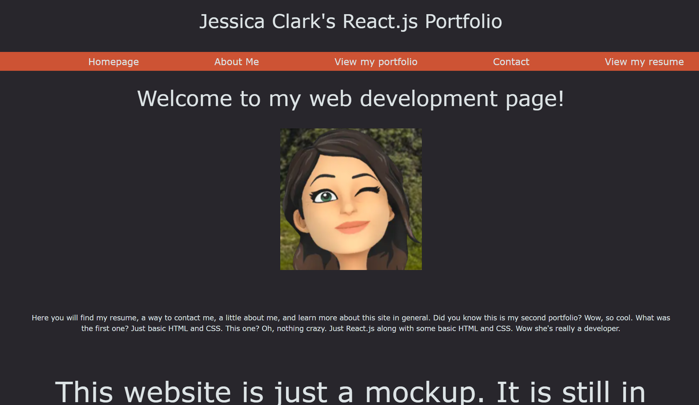

 # React Portfolio

## Table of Contents

-[Description](#description)

-[Installation](#installation)

-[Usage](#usage)

-[Credits](#credits)

-[Testing](#testing)

-[License](#license)

-[How to Contribute](#how-to-contribute)

### Description

This project was to show that I can create a portfolio that will stand out against my colleagues when it comes to my work. It also shows that I do in fact know how to code in React.js and can build a website using it. The main thing was to showcase my work, provide a way for people to contact me, provide a resume to any future employers or possibly any other developer that wants help on a project they may be working on and to show a little about me as a person. 

### Installation

Vite, React, and eslint were all used in this project. Simply type "npm i" in your terminal to install the packages and "npm run dev" in order to start the server and view the webpage on your local host.

### Usage

This project was intended for any future employers/colleagues that may want to get a better idea of what my work may look like or contact me to see how I can help them on their projects/clients.

### Credits

W3Schools helped a lot when trying to figure out the CSS when certain parts of the project weren't functioning correctly(), Coolors.co was used to define the colorscheme of the project, scaler.com was used in order to figure out how to make my portfolio images were the same size, and finally, my classmates, Christina Sullivan and Tor First helped by reminding me that React.js uses className instead of class.

### Testing

The main testing that took place was running Vite and watching the webpage run in real time to see which parts went where and to see how the CSS looked on the features.

### License

MIT: https://opensource.org/license/mit

### How to Contribute

People cna contribute by reaching out on my linkedin, (https://www.linkedin.com/in/jessica-clark-777156296/)
